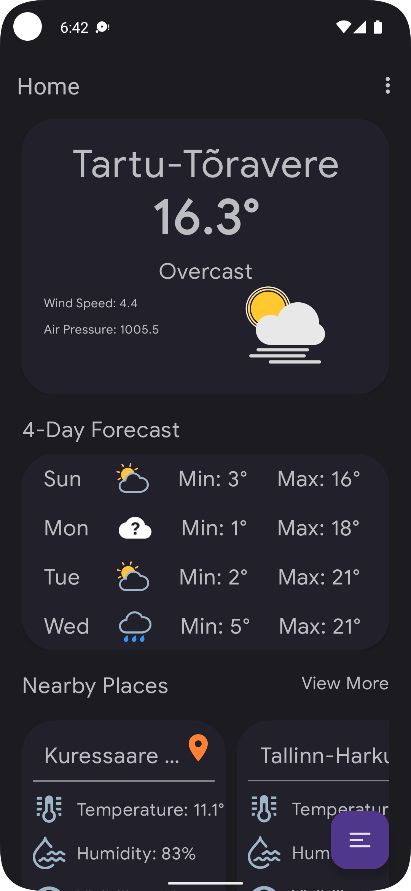
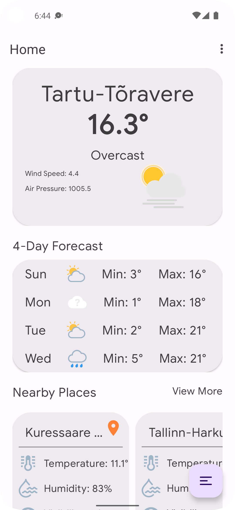
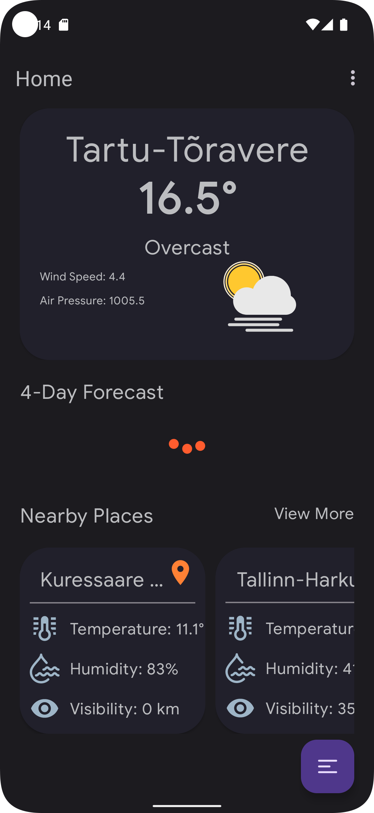
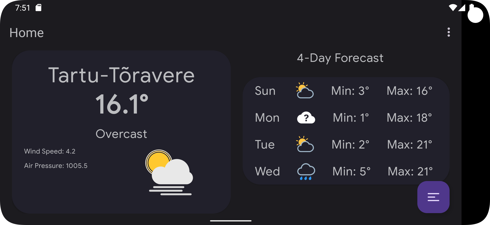

## Description

This is a weather forecast application based on the modern Android development tools

### Want to see the task assignment?

You can find it [Here](TASK.md)

### Need to download latest release APK?

### Screen Shots

### Libraries and Tools
- [x] Android Studio Electric Canary 3
- [x] **Kotlin 1.7-Beta**
- [x] **Context Receivers**
- [x] **KSP (Kotlin Symbol Processing)**: is a library for processing Kotlin source files.
- [x] Clean Architecture
- [x] MVVM
- [x] Single Activity
- [x] Dagger Hilt
- [x] Github CI (Automated Release APK, UnitTests)
- [x] Retrofit
- [x] Coroutines (**RepeatOnLifeCycle API**)
- [x] Navigation (**SafeArgs**)
- [x] ViewBinding
- [x] Material Design
- [x] Portrait + Landscape
- [x] SharedElement Transition
- [x] Coil
- [x] UnitTests (Mockk): is a library for mocking and verifying Kotlin code.

### Notes

- There are some **PBIs** (Product-Backlog-Item) in the Backlog section that could be implemented in
  the future
- There are some **TODOs** in the project source code. Most of them are additional features that
  could be implemented in the future
- The current weather is shown in the main screen for specific city code. But its better to show it
  using **user's location**.
- Some of objects in observation field in the api/estonia/current/ endpoint, have an empty string for their `wmocode`.
  So we can't make an API call for this places. instead we can show details from previous screen.
- The API doesn't provide any image url for the place. So it's better to use some random images from network to have a better UX.

### Backlog

- [ ] Network Error Animation + Retry Button
- [ ] Add Swipe Refresh
- [ ] Jetpack Compose Version
- [ ] Room
- [ ] MotionLayout
- [ ] Fragments Split (Converting fat Fragments to small fragments)
- [ ] MultiThreading (Coroutines ThreadPoolExecutor)
- [ ] First Offline Cache
- [ ] Google Maps Location
- [ ] Paging
- [ ] MultiModule
- [ ] DatePicker
- [ ] MultiLanguage
- [ ] MultiTheme
- [ ] Network Check
