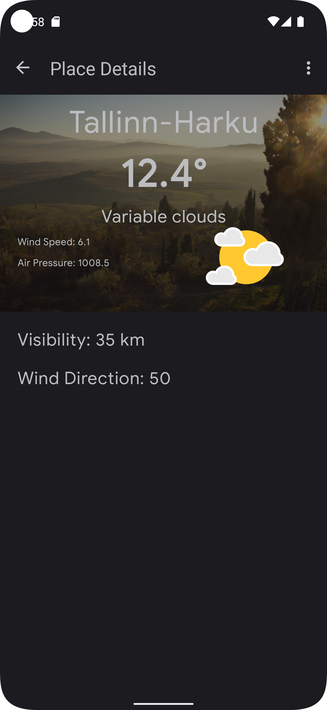

## Description

This is a weather forecast application based on the modern Android development tools

### Want to see the task assignment?

You can find it [Here](TASK.md)

### Need to download the latest release APK?

You can download the latest version via [Github CI](https://github.com/MortezaNedaei/Clean-Weather/suites/6640138403/artifacts/250639351) or you can see all releases in [Github Releases](https://github.com/MortezaNedaei/Clean-Weather/releases)

### How to start?

If you are using the stable version of AndroidStudio, you need to downgrade the gradle plugin version to a stable version.

### Screen Shots

### Libraries and Tools
- [x] Android Studio Electric Canary 3
- [x] **Kotlin 1.7-Beta**
- [x] **Context Receivers**
- [x] **KSP (Kotlin Symbol Processing)**: is a library for processing Kotlin source files.
- [x] Clean Architecture
- [x] MVVM
- [x] Single Activity
- [x] Dagger Hilt
- [x] Room Offline Database
- [x] Cache Strategy ([Offline-First](https://github.com/MortezaNedaei/Clean-Weather/blob/ef81b6d44d5f0afabb1e5327452c4691775fb624/app/src/main/java/com/mooncascade/data/respository/ObservationDataRepository.kt#L78), [Online-First](https://github.com/MortezaNedaei/Clean-Weather/blob/ef81b6d44d5f0afabb1e5327452c4691775fb624/app/src/main/java/com/mooncascade/data/respository/ObservationDataRepository.kt#L56))
- [x] Coroutines (**RepeatOnLifeCycle API**)
- [x] Navigation (**SafeArgs**)
- [x] Retrofit
- [x] ViewBinding
- [x] Material Design
- [x] Portrait + Landscape
- [x] SharedElement Transition
- [x] Coil
- [x] UnitTests (Mockk): is a library for mocking and verifying Kotlin code.
- [x] Github CI (Automated Release APK, UnitTests)
- [x] Network Check

### Notes

- There are some **PBIs** (Product-Backlog-Item) in the Backlog section that could be implemented in
  the future
- There are some **TODOs** in the project source code. Most of them are additional features that
  could be implemented in the future
- The current weather is shown in the main screen for specific city code. But its better to show it
  using **user's location**.
- Some of objects in observation field in the api/estonia/current/ endpoint, have an empty string for their `wmocode`.
  So we can't make an API call for this places. instead we can show details from previous screen.
- The API doesn't provide any image url for the place. So it's better to use some random images from network to have a better UX.
- Some place ids in the `estonia/current` response, could not be found in `world/locations/{id}`. So you might see handled error of `Network Error: Not Found`

### Backlog

- [ ] Network Error Animation + Retry Button
- [ ] Add Swipe Refresh
- [ ] Jetpack Compose Version
- [ ] MotionLayout
- [ ] Fragments Split (Converting fat Fragments to small fragments)
- [ ] MultiThreading (Coroutines ThreadPoolExecutor)
- [ ] Google Maps Location
- [ ] Paging
- [ ] MultiModule
- [ ] DatePicker
- [ ] MultiLanguage
- [ ] MultiTheme